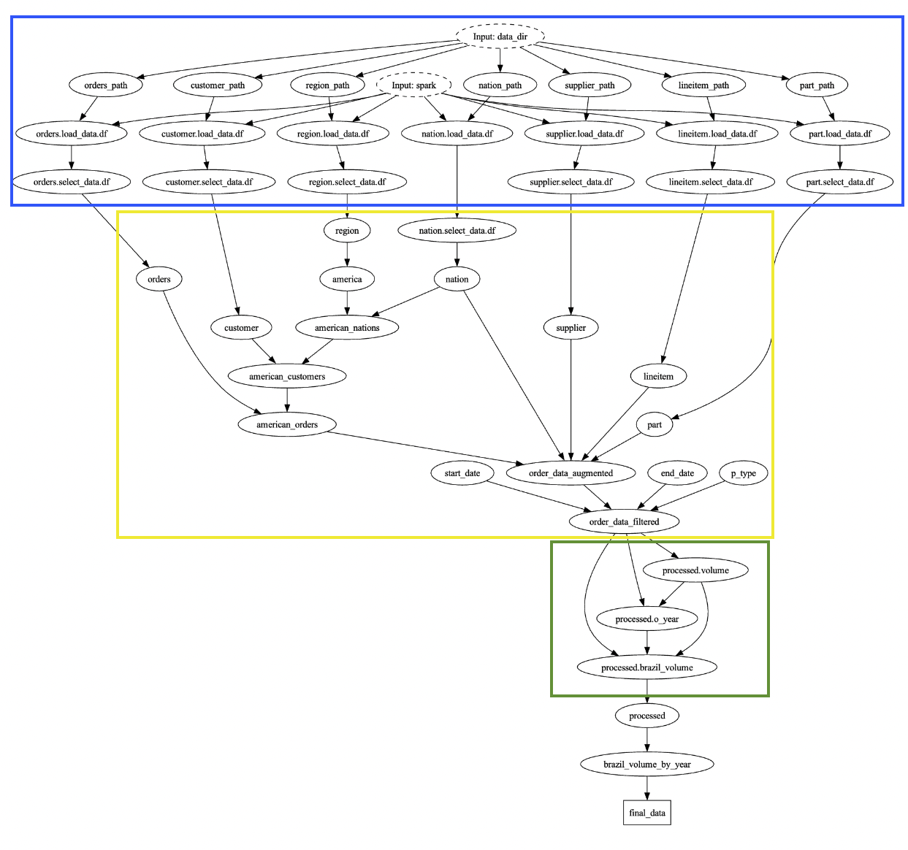
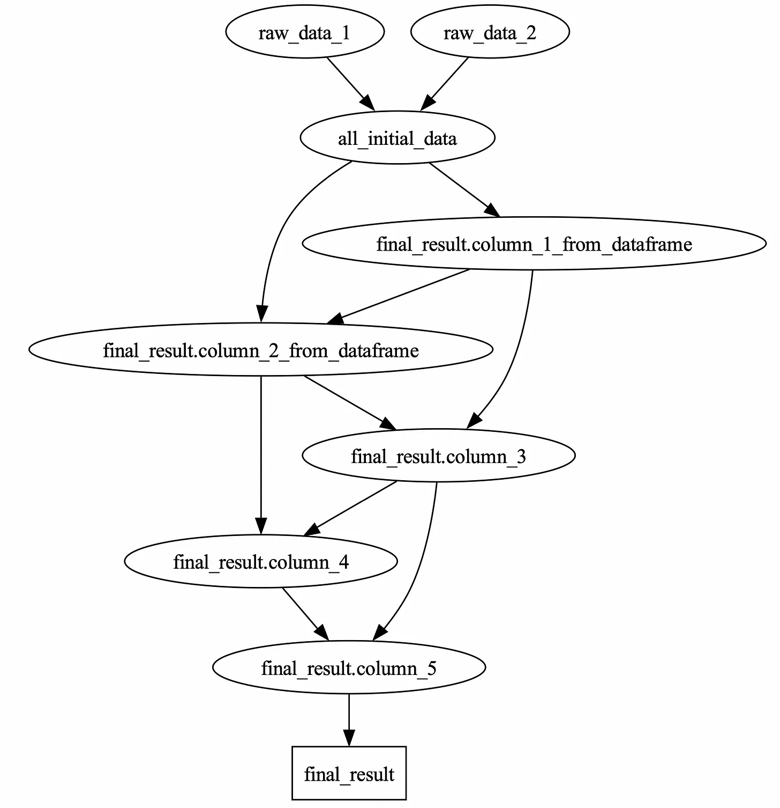

# Hamilton and Pyspark

**TL;DR** Hamilton now has a full pyspark integration. This enables you to build modular pyspark applications
by declaring each transformation as a hamilton function. The new `with_columns` decorator enables you to specify a
series of individual column operations to a dataframe, written as pandas UDFs, python UDFs, or function of pyspark dataframes.
Together with vanilla Hamilton, this new integration can help you break complex pyspark code into a series of self-contained, unit-testable functions.

<p align="center">

</p>

*A spark application written with Hamilton that represents multiple joins (in blue), a set of map operations (in green) and a set of  join/filters (in yellow). This uses Hamilton’s visualization features (with a little extra annotation). See [TPC-H query 8](../tpc-h/query_8.py) for motivation.*

## Apache Spark
[Apache Spark](https://spark.apache.org/) (and its python API, [pyspark](https://spark.apache.org/docs/latest/api/python/index.html)) is an open-source library for building out highly scalable data transformations.
At its core is the notion of the RDD (resilient distributed dataframe), which represents a lazily evaluated,
partitioned, in-memory dataset that stores the information needed to recreate the data
if any of the servers computing it fail. The pyspark library gives data practitioners
a dataframe-centric API to interact with this in python, enabling them to specify computation
and scale up to the resources they have available. Since its introduction in 2014, spark has taken
off and is now the de facto way to perform computations on large (multi gb -> multi tb) datasets.

## Limitations of Spark for Complex Dataflows

Just like any data transformation scripts, spark applications can be difficult to maintain and manage,
and often devolve into spaghetti code over time.
Specifically, we've observed the following problems with pyspark code:

1. _They rarely get broken up into modular and reusable components._
2. _They commonly contain "implicit" dependencies._ Even when you do break them into functions, it is difficult to specify which columns the transformed dataframes depend on, and how that changes throughout your workflow.
3. _They are difficult to configure in a readable manner._ A monolithic spark script likely has a few different shapes/parameters, and naturally becomes littered with poorly documented if/else statements.
4. _They are not easy to unit test._ While specific UDFs can be tested, spark transformations are tough to test in a modular fashion.
5. _They are notoriously tricky to debug._ Large pipelines of spark transformations (much like SQL transformations) will often have errors that cascade upwards, and pinpointing the source of these can be quite a challenge.


# Hamilton
As this is a README inside the Hamilton repository, we assume some basic familiarity. That said, here's a quick primer:

Hamilton is an open-source Python framework for writing data transformations.
One writes Python functions in a declarative style, which Hamilton parses into nodes in
a graph based on their names, arguments and type annotations. The simple rule is akin to that of pytest fixtures --
the name of a parameter points to another node (function) in the graph, and the name of the function defines a referencable node.
You can request specific outputs, and Hamilton will execute the required nodes (specified by your functions) to produce them.

You can try hamilton out in your browser at [tryhamilton.dev](https://tryhamilton.dev).

# Integration

Breaking your spark application into Hamilton functions with pyspark dataframes as inputs and outputs gets you most of
the way towards more modular/documented code.
That said, it falls flat in a critical area – column-level lineage/transformation
simplicity. For complex series of map operations, spark represents all transformations
on a single dataframe in a linear chain by repeatedly calling `withColumn`/`select` to create columns.
For dataframe APIs that manage indices, hamilton improves this experience by encouraging the user to
pull apart column-level transformations then join later. With columns that share cardinality, this is generally an efficient approach.

Spark, however, has no notion of indices. Data is partitioned across a cluster, and once a set of columns is selected it has the potential to be reshuffled.
Thus, the two options one previously had for integrating with pyspark both have disadvantages:

1. Extracting into columns then joining is prohibitively expensive and taxing on the spark optimizer (which we have not found was smart enough to detect this pattern)
2. Running pure DataFrame transformations does not afford the expressiveness that Hamilton provides.

The idea is to break your transformations into sections that form one of two shapes.

1. Run linearly (e.g. cardinality non-preserving operations: aggregations, filters, joins, etc..)
2. Form a DAG of column-level operations (for cardinality-preserving operations)

For the first case, we just use the pyspark dataframe API. You define functions that, when put
through Hamilton, act as a pipe. For example:

### Joins/Aggregations/Filters

Case 1: load, join, and filter data (aggregations not shown):
```python
import pyspark.sql as ps

@load_from.csv(path="data_1.csv" inject_="raw_data_1", spark=source("spark"))
@load_from.parquet(path="data_2.parquet", inject_="raw_data_2")
def all_initial_data_unfiltered(raw_data_1: ps.DataFrame, raw_data_2: ps.DataFrame) -> ps.DataFrame:
    """Combines the two loaded dataframes"""
    return _custom_join(raw_data_1, raw_data_2)

def all_initial_data(all_inital_data_unfiltered: ps.DataFrame) -> ps.DataFrame:
    """Filters the combined dataframe"""
    return _custom_filter("some_column > 0")
```

### Columnar Operations

Case 2: define columnar operations in a DAG:

```python
import pandas as pd

def column_3(column_1_from_dataframe: pd.Series) -> pd.Series:
    return _some_transform(column_1_from_dataframe)

def column_4(column_2_from_dataframe: pd.Series) -> pd.Series:
    return _some_other_transform(column_2_from_dataframe)

def column_5(column_3: pd.Series, column_4: pd.Series) -> pd.Series:
    return _yet_another_transform(column_3, column_4)
```

Finally, we combine them together with a call to `with_column`:

```python
from hamilton.plugins.h_spark import with_columns

import pyspark.sql as ps
import map_transforms # file defined above

@with_columns(
    map_transforms,
    columns_to_pass=["column_1_from_dataframe", "column_2_from_dataframe"]
)
def final_result(all_initial_data: ps.DataFrame) -> ps.DataFrame:
    """Gives the final result. This decorator will apply the transformations in the order specified in the DAG.
    Then, the final_result function is called, with the result of the transformations passed in."""
    return _process(all_initial_data)
```

Contained within the `load_from` functions/modules is a set of transformations that specify a DAG.
These transformations can take multiple forms – they can use vanilla pyspark operations, pandas UDFs,
or standard python UDFs. See documentation for specific examples.

The easiest way to think about this is that the `with_columns` decorator “linearizes” the DAG.
It turns a DAG of hamilton functions into a topologically sorted chain, repeatedly appending those columns to the initial dataframe.
<p align="center">

</p>
_The DAG of hamilton functions derived from the above code. Note the nodes that are prefixed with the final_result namespace_

`@with_columns` takes in the following parameters (see the docstring for more info)

1. `load_from` -- a list of functions/modules to find the functions to load the DAG from, similar to `@subdag`
2. `columns_to_pass` -- not compatible with `pass_dataframe_as`. Dependencies specified from the initial dataframe,
injected in. Not that you must use one of this or `pass_dataframe_as`
3. `pass_dtaframe_as` -- the name of the parameter to inject the initial dataframe into the subdag.
If this is provided, this must be the only pyspark dataframe dependency in the subdag that is not also another
node (column) in the subdag.
4. `select` -- a list of columns to select from the UDF group. If not specified all will be selected.
5. `namespace` -- the namespace of the nodes generated by this -- will default to the function name that is decorated.

Note that the dependency that forms the core dataframe will always be the first parameter to the function. Therefore, the first parameter
must be a pyspark dataframe and share the name of an upstream node that returns a pyspark dataframe.

You have two options when presenting the initial dataframe/how to read it. Each corresponds to a `with_columns` parameter. You can use:
1.`columns_to_pass` to constrain the columns that must exist in the initial dataframe, which you refer to in your functions. In the example above, the functions can refer to the three columns `column_1_from_dataframe`, `column_2_from_dataframe`, and `column_3_from_dataframe`, but those cannot be named defined by the subdag.
2. `pass_dataframe_as` to pass the dataframe you're transforming in as a specific parameter name to the subdag. This allows you to handle the extraction -- use this if you want to redefine columns in the dataframe/preserve the same names.

```python
import pandas as pd, pyspark.sql as ps

#map_transforms.py

def colums_1_from_dataframe(input_dataframe: ps.DataFrame) -> ps.Column:
    return input_dataframe.column_1_from_dataframe

def column_2_from_dataframe(input_dataframe: ps.DataFrame) -> ps.Column:
    return input_dataframe.column_2_from_dataframe

def column_3(column_1_from_dataframe: pd.Series) -> pd.Series:
    return _some_transform(column_1_from_dataframe)

def column_4(column_2_from_dataframe: pd.Series) -> pd.Series:
    return _some_other_transform(column_2_from_dataframe)

def column_5(column_3: pd.Series, column_4: pd.Series) -> pd.Series:
    return _yet_another_transform(column_3, column_4)
```

```python
from hamilton.experimental.h_spark import with_columns
import pyspark.sql as ps
import map_transforms # file defined above

@with_columns(
    map_transforms, # Load all the functions we defined above
    pass_dataframe_as="input_dataframe", #the upstream dataframe, referred to by downstream nodes, will have this parametter name
)
def final_result(all_initial_data: ps.DataFrame) -> ps.DataFrame:
    """Gives the final result. This decorator will apply the transformations in the order.
    Then, the final_result function is called, with the result of the transformations passed in."""
    return _process(all_initial_data)
```

Approach (2) requires functions that take in pyspark dataframes and return pyspark dataframes or columns for the functions reading directly from the dataframe.
If you want to stay in pandas entirely for the `with_columns` group, you should use approach (1).

### Flavors of UDFs

There are four types of transforms supported that can compose the group of DAG transformations:

#### Pandas -> Pandas UDFs
These are functions of series:

```python
from hamilton import htypes

def foo(bar: pd.Series, baz: pd.Series) -> htypes.column[pd.Series, int]:
    return bar + 1
```

The rules are the same as vanilla hamilton -- the parameter name determines the upstream dependencies
and the function name determines the output column name.

Note that, due to the type-specification requirements of pyspark, these have to return a "typed" (`Annotated[]`) series, specified by `htypes.column`. These are adapted
to form pyspark-friendly [pandas UDFs](https://spark.apache.org/docs/3.1.2/api/python/reference/api/pyspark.sql.functions.pandas_udf.html)

#### Python primitives -> Python Primitives UDFs

These are functions of python primitives:

```python
def foo(bar: int, baz: int) -> int:
    return bar + 1
```

These are adapted to standard [pyspark UDFs](https://spark.apache.org/docs/3.1.3/api/python/reference/api/pyspark.sql.functions.udf.html).

#### Pyspark Dataframe -> Pyspark Columns

These are functions that take in a pyspark dataframe (single) and output a pyspark column.

```python
def foo(bar: ps.DataFrame) -> ps.Column:
    return df["bar"] + 1
```

Note that these have two forms:
1. The dataframe specifies the name of the upstream column -- then you just access the column and return a manipulation
2. The dataframe contains more than one column, in which case you need the `@require(...)` decorator, to specify which column you want to use.

```python
import h_spark


@h_spark.require_columns("bar", "baz")
def foo(bar_baz: ps.DataFrame) -> ps.Column:
   return df["bar"] + 1
```

In this case we are only allowed a single dataframe dependency, and the parameter name does not matter.
The columns specified are injected into the dataframe, allowing you to depend on multiple upstream columns.

#### pyspark dataframe -> pyspark dataframe

This is the ultimate power-user case, where you can manipulate the dataframe in any way you want.
Note that this and the column-flavor is an _out_, meaning that its a way to jump back to the pyspark world and not have to break up
your map functions for a windowed aggregation. You can easily shoot yourself in the foot here. This should only be used if
you strongly feel the need to inject a map-like (index-preserving, but not row-wise) operation into the DAG,
and the df -> column flavor is not sufficient (and if you find yourself using this a lot, please reach
out, we'd love to hear your use-case).

This has the exact same rules as the column flavor, except that the return type is a dataframe.

```python
import h_spark


@h_spark.require_columns("bar", "baz")
def foo(df: ps.DataFrame) -> ps.DataFrame:
   return df.withColumn("bar", df["bar"] + 1)
```

Note that this is isomorphic to the column-flavor in which you (not the framework) are responsible for calling `withColumn`.

We have implemented the hamilton hello_world example in [run.py](run.py) and the [map_transforms.py](map_transforms.py)/[dataflow.py](dataflow.py) files
so you can compare. You can run `run.py`:

`python run.py`

and check out the interactive example in the `notebook.ipynb` file.

We have also implemented three of the [TPC-H](https://www.tpc.org/tpch/) query functions to demonstrate a more real-world set of queries:
1. [query_1](../tpc-h/query_1.py)
2. [query_8](../tpc-h/query_8.py)
3. [query_12](../tpc-h/query_12.py)

See the [README](../tpc-h/README.md) for more details on how to run these.


## Technical Details

The `with_columns` decorator does the following:
1. Resolves the functions you pass in, with the config passed from the driver
2. Transforms them each into a node, in topological order.
   - Retains all specified dependencies
   - Adds a single dataframe that gets wired through (linearizing the operations)
   - Transforms each function into a function of that input dataframe and any other external dependencies

Thus the graph continually assigns to a single (immutable) dataframe, tracking the result, and still displays the DAG shape
that was presented by the code. Column-level lineage is preserved as dependencies and easy to read from the code, while it executes as a
normal set of spark operations.

## Scaling Alternatives

Pyspark is not the only way to scale up your computation.  Hamilton supports `pandas-on-spark` as well. You can use pandas-on-spark with the `KoalaGraphAdapter` -- see [Pandas on Spark](../pandas_on_spark/README.md) for reference.
Some people prefer vanilla spark, some like pandas-on-spark. We support both. Hamilton also support executing map-based pandas UDFs in pyspark, in case you want simple parallelism. See [pyspark_udfs](../pyspark_udfs/README.md) for reference.

Hamilton has integrations with other scaling libraries as well -- it all depends on your use-case:

- [dask](../../dask/README.md)
- [ray](../../ray/README.md)
- [modin](https://github.com/modin-project/modin) (no example for modin yet but it is just the pandas API with a different import)

## Next Steps
A few interesting directions:
1. Improve the visualization, allowing you to differentiate the dependencies that just exist for structure from the central linear dependency that flows through.
2. Add similar capabilities for other dataframe libraries for which series/indices are not first-class citizens (polars, etc...)
3. Add data quality decorations for spark -- this is complex as they often require realization of the DAG, which one typically wishes to delay along with the rest of the computation
4. Add more data loaders to seamlessly load data to spark/from spark
5. Add natural constructs for `collect()`/`cache()` through the DAG
