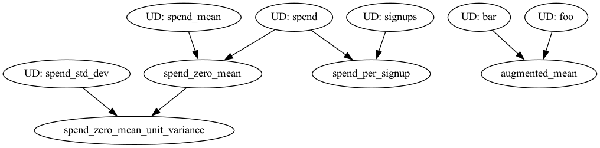

# Using Hamilton to help manage your pyspark UDFs

Here we have a version of the Hamilton hello world example showing how you can take some Hamilton functions and then
easily run them as pyspark UDFs.

## Dependencies

`pip install "sf-hamilton[pyspark, visualization]"` for the right dependencies to run this example.

## File organization:

* `pandas_udfs.py` contains UDF definitions that Hamilton will know how to run as `pandas_udfs` on pyspark.
* `vanilla_udfs.py` contains UDF definitions that Hamilton will know how to run as row based UDFs on pyspark.
* `run.py` contains spark driver and hamilton driver code to run everything.

## To run

```bash
python run.py pandas  # to run using pandas_udfs
python run.py vanilla  # to run using vanilla_udfs
```
You should get the following as output:

```
+-----+-------+------------------+----------------+-----------------------------+---+---+--------------+
|spend|signups|     avg_3wk_spend|spend_per_signup|spend_zero_mean_unit_variance|foo|bar|augmented_mean|
+-----+-------+------------------+----------------+-----------------------------+---+---+--------------+
|   10|      1|              10.0|            10.0|                   -1.0644054|1.0|2.0|           3.0|
|   10|     10|              10.0|             1.0|                   -1.0644054|1.0|2.0|           3.0|
|   20|     50|13.333333333333334|             0.4|                  -0.48382062|1.0|2.0|           3.0|
|   40|    100|23.333333333333332|             0.4|                    0.6773489|1.0|2.0|           3.0|
|   40|    200|33.333333333333336|             0.2|                    0.6773489|1.0|2.0|           3.0|
|   50|    400|43.333333333333336|           0.125|                    1.2579336|1.0|2.0|           3.0|
+-----+-------+------------------+----------------+-----------------------------+---+---+--------------+
```
with Hamilton showing you the following execution visualization:

Note: foo, bar, and augmented_mean do not depend on any inputs in the dataframe.

# What Hamilton does under the hood

You need to use the `PySparkUDFGraphAdapter` for this to work. This is because Hamilton needs to know how to
augment operations for pyspark. With this adapter, Hamilton will:

1. Takes care of the spark boilerplate for you in creating a UDF.
2. Intelligently knows whether to pull from the dataframe for input to a function, based on column names,
or pulls from the passed in dictionary of inputs for that UDF.
3. **Append** the requested outputs to the dataframe.
4. Operate on the premise that as part of the inputs field to `dr.execute(..., inputs=INPUTS)`, the `INPUTS`
dictionary contains a mapping of column name to pyspark dataframe. Hamilton will then know to use that **single**
dataframe to pull from and append columns to, to coordinate UDF execution.
5. Assume all functions are `map` based functions. If they're not, then you'll need to manually
manage that outside of Hamilton.

# Why is Hamilton useful here?

1. It makes it easy to write UDFs that can be run in a distributed setting.
2. Those UDFs can be run in other contexts that don't use spark!
3. Hamilton forces you to curate UDFs and thus they subsequently can be versioned, tested, documented, and reused
in other spark jobs easily. Think reusable feature definitions, think reusable metric definitions! Assumption: they
have to be `map` based functions.
4. Anyone who wants to use these UDFs, MUST ALIGN ON COLUMNS NAMES! This is a good thing, because it means that you can
standardize on column names and reuse UDFs across different spark jobs, which lowers your maintenance burden!
5. If you don't care about intermediate outputs, Hamilton won't add them. It'll only add the outputs you want to the
passed in dataframe.

# Limitations

1. The `PySparkUDFGraphAdapter` currently only supports `map` based functions.
2. The only `pandas_udfs` signature currently supported is for functions with pd.Series as inputs, and pd.Series as output.
3. `@check_output` annotations are not currently supported for pyspark UDFs at this time. But we're working on it - ping
us in slack (or via issues) if you need this feature!

# Future work

## Auto vectorize UDFs to be pandas_udfs
We could under the hood translate basic vanilla python UDF functions to use the pandas_udf route. This could be a
variable passed to the PySparkUDFGraphAdapter to enable it/or require some annotation on the function, or both.
Let us know if this would be useful to you!

## All the Pandas UDF signatures

(1) Let us know what you need.
(2) Implementation is a matter of (a) getting the API right, and (b) making sure it fits with the Hamilton way of thinking.

## Aggregation UDFs

We just need to determine what a good API for this would be. We're open to suggestions!

## Other dataframe operations

We could support other dataframe operations, like joins, etc. We're open to suggestions! The main issue is creating
a good API for this.

# Other questions

## Can't I just use pyspark dataframes directly with Hamilton functions?

Yes, with Hamilton you could write functions that define a named flow that operates entirely over pyspark dataframes.
However, you lose a lot of the flexibility of Hamilton doing things that way. We're open to suggestions,
or API changes to make this approach easier.
