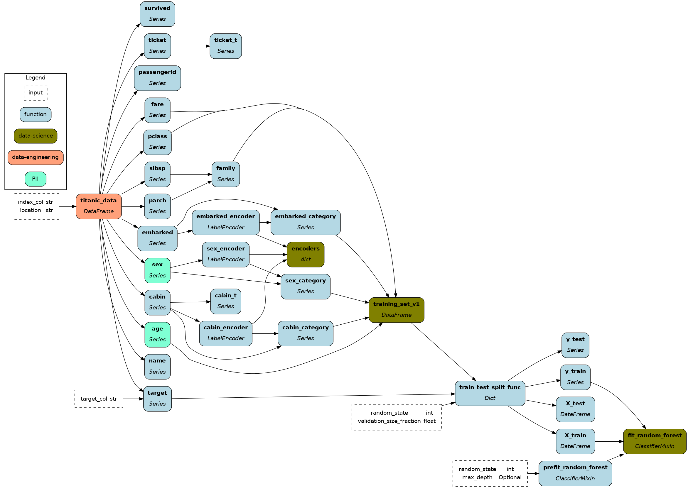

# Style your dataflow visualizations

A core feature of Hamilton is the ability to generate visualizations directly from your code. By default, each nodes is labelled with its name and type and is stylized (shape, color, outline, etc.).

Now, it is possible to customize the visualization style based on node attributes. To do so, you need to define a function that will be applied to each node of the graph.

```python
from hamilton import graph_types
from typing import Tuple, Optional

def custom_style(
    *, node: graph_types.HamiltonNode, node_class: str
) -> Tuple[dict, Optional[str], Optional[str]]:
    """Custom style function for the visualization.

    :param node: node that Hamilton is styling.
    :param node_class: class used to style the default visualization
    :return: a triple of (style, node_class, legend_name) where
        style: dictionary of graphviz attributes https://graphviz.org/docs/nodes/,
        node_class: class used to style the default visualization - we recommend keeping it by passing `None`
        legend_name: text to display in the legend. Return `None` for no legend entry.
    """
    if node.tags.get("some_key") == "some_value":
        style = ({"fillcolor": "blue"}, node_class, "some_key")

    elif node.tags.get("module") == "my_functions":
        style = ({"fillcolor": "orange"}, node_class, "features")

    else:
        style = ({}, node_class, None)

    return style

# pass the function to `custom_style_function=`
dr.visualize_execution(..., custom_style_function=custom_style)
dr.visualize_path_between(..., custom_style_function=custom_style)
dr.visualize_materialization(..., custom_style_function=custom_style)
```
## Steps to define your custom style

1. The function must used only keyword arguments, taking in `node` and `node_class`.
2. It needs to return a tuple `(style, node_class, legend_name)` where:
    - `style`: dictionary of valid [graphviz node style attributes](https://graphviz.org/doc/info/attrs.html).
    - `node_class`: class used to style the default visualization - we recommend return the input `node_class`
    - `legend_name`: text to display in the legend. Return `None` for no legend entry.
3. For the execution-focused visualizations, your custom styles is applied before the modifiers for outputs and overrides are applied.

If you need more customization, we suggest getting the graphviz object back, and then modifying it yourself.

This [online graphviz editor](https://edotor.net/) can help you get started!


## Use cases
The Hamilton visualizations help you document your code and communicate what your dataflow does. Adapting the style to your given context can help highlight
- code ownership
- data sources
- personally identifiable information
- elements for different stakeholders



Having access to `graph_types.HamiltonNode` as input means you can customize based on node name, type, tags, originating function, and more, allowing for a great degree of flexibility.

## Node classes
The default Hamilton visualization currently relies on 3 node classes:
- `"function"`: default node type
- `"input"`: input node, i.e., that doesn't have an associated function
- `"config"`: value passed to the Driver config

and `"function"` nodes can receive several modifiers:
- `"override"`: for override values passed to `.execute()` or `.materialize()`
- `"output"`: for values returned by `.execute()` (`final_vars`) or `.materialize()` (`materializers` and `additional_vars`)
- `"materializer"`: nodes added to the dataflow by `.materialize()`
- `"parallelizable"`/`"expand"`: functions annotated with `Parallelizable[]` or `Expand[]`
- `"field"` and `"cluster"`: are both associated with the schema [visualization feature](https://hamilton.dagworks.io/en/latest/reference/decorators/schema/#schema)

We recommend not using these names as `legend_name` when defining your custom style to avoid conflicts.
