# Hamilton UI

This contains the code for the new Hamilton UI. For an overview of getting started & features
[see this documentation](https://hamilton.dagworks.io/en/latest/concepts/ui). For a lengthier post and intro see our [blog post](https://blog.dagworks.io/p/hamilton-ui-streamlining-metadata).

## One operational UI for all your dataflows

The Hamilton UI is a system that provides the following capabilities:

1. Execution tracking with associated metadata
   * Provides a persistent database to store/manage these
   * Provides a server that allows reading/writing/authentication
2. Data/artifact observability: provides telemetry/observability of Hamilton executions + specific function results/code through a web interface
3. Lineage & provenance: allows you to quickly inspect how code and data is connected.
4. Catalog: everything is observed and cataloged, so you can quickly search and find what exists and when it was run.

The UI is meant to monitor/debug Hamilton dataflows both in **development** and **production**. The aim is to enable
dataflow authors to move faster during all phases of the software development lifecycle.

For an overview of some of these features [you can watch this quick video](https://youtu.be/0VIVSeN7Ij8?si=maeV0zdzTPSqUl1N).

### Execution Tracking

<p align="center">
  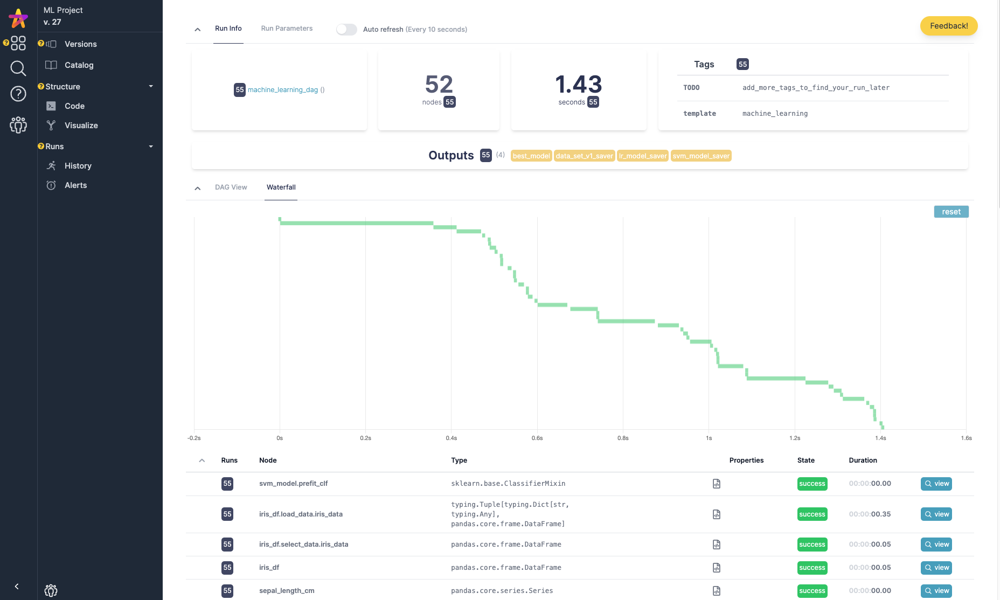
  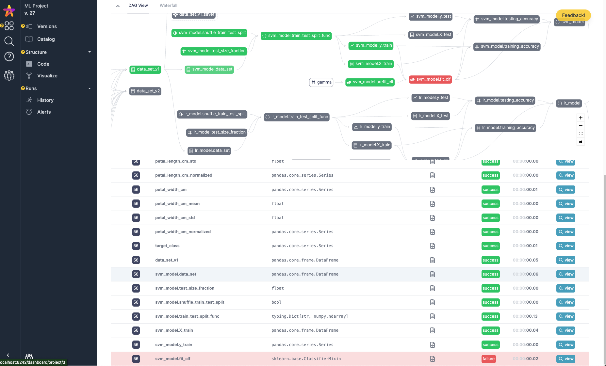
  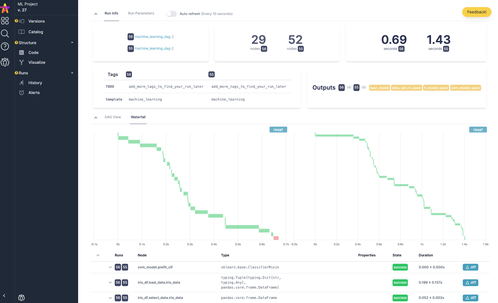
</p>
<p align="center">
  <em>See what's slow (left), pinpoint errors (middle) compare execution performance (right)</em>
</p>

### Data/Artifact Observability

<p align="center">
  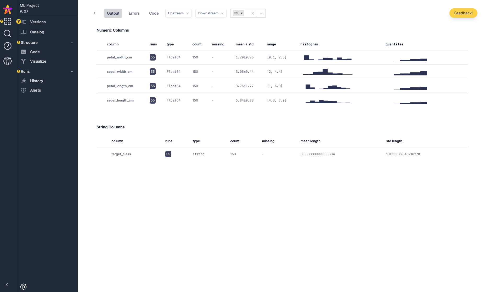
  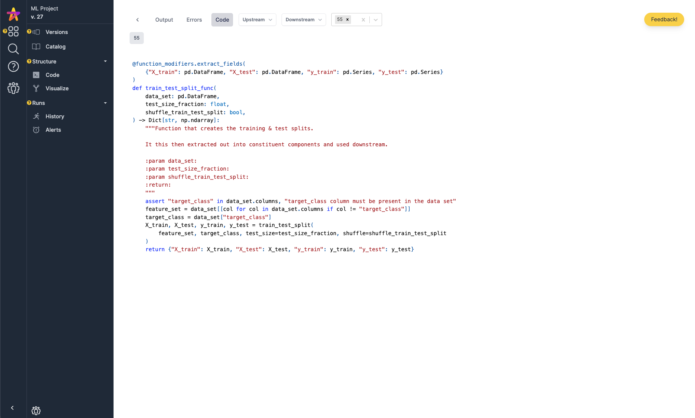
  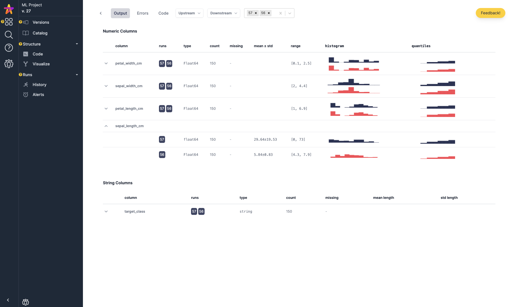
</p>
<p align="center">
  <em>Visualize data for a run (left), track code the run used (middle) compare data across executions (right)</em>
</p>

### Lineage & Provenance

<p align="center">
  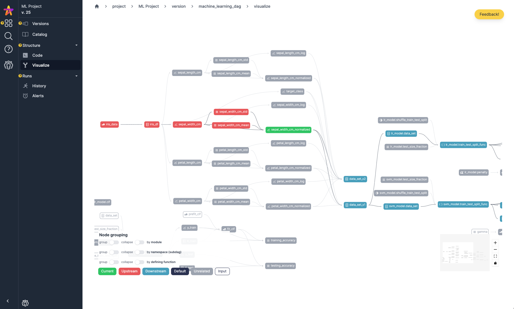
  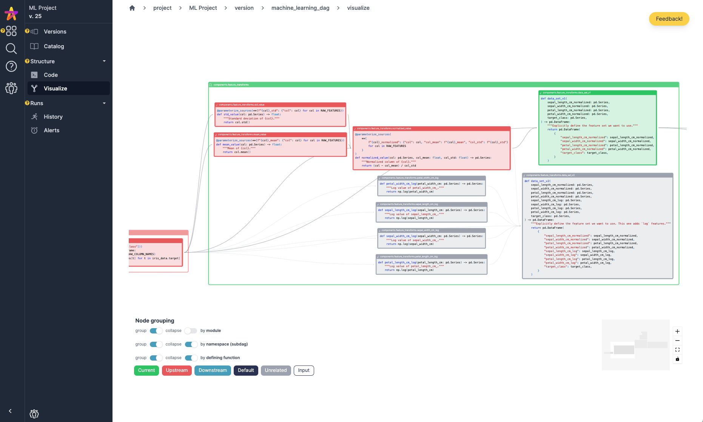
</p>
<p align="center">
  <em>See how things connect: what's upstream/downstream (left), walk through code visually (right) </em>
</p>

### Catalog

<p align="center">
  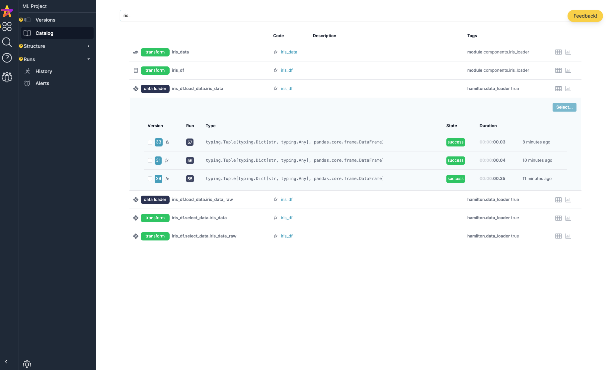
  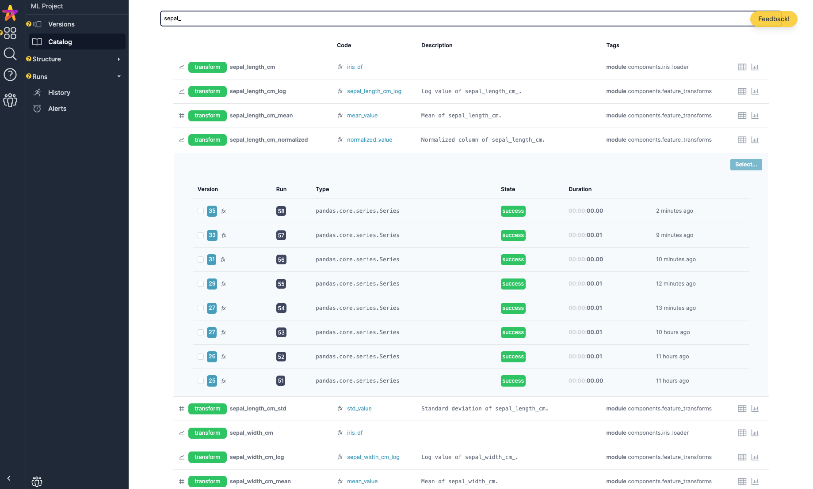
</p>
<p align="center">
  <em>Understand artifacts produced (left), find features and when they were used (right) </em>
</p>

## Getting started

You can watch this [video walkthrough on getting set up](https://youtu.be/DPfxlTwaNsM).

Make sure you have docker running:
```bash
# clone the repository if you haven't
git clone https://github.com/dagworks-inc/hamilton
# change into the UI directory
cd hamilton/ui
# run docker
./run.sh
```
Once docker is running navigate to http://localhost:8242 and create an email and a project; then follow
instructions on integrating with Hamilton.

A fuller guide can be found [here](https://hamilton.dagworks.io/en/latest/concepts/ui).

## Architecture

The architecture is simple.

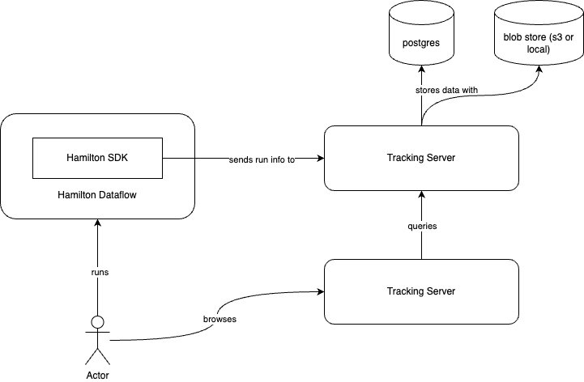

The tracking server stores data on postgres, as well as any blobs on s3. This is stored in a docker volume
on local mode. The frontend is a simple React application. There are a few authentication/ACL capabilities,
but the default is to use local/unauthenticated (open). Please talk to us if you have a need for more custom authentication.


## Development

The structure involves a bit of cleverness to ensure the UI can easily be deployed and served from the CLI.

We have a symlink from `backend/hamilton_ui` to `backend/server`, allowing us to work with django's structure
while simultaneously allowing for import as hamilton_ui. (this should probably be changed at some point but not worth it now).

To deploy, use the `admin.py` script in the UI directory.

This:

1. Builds the frontend
2. Copies it into the build/ directory
3. Publishes to the [sf-hamilton-ui](https://pypi.org/project/sf-hamilton-ui/) package on pypi

Then you'll run it with `hamilton ui` after installing `sf-hamilton[ui]`. Note to
talk to it you'll need the hamilton_sdk pacakge which can be installed with `pip install sf-hamilton[sdk]`.
