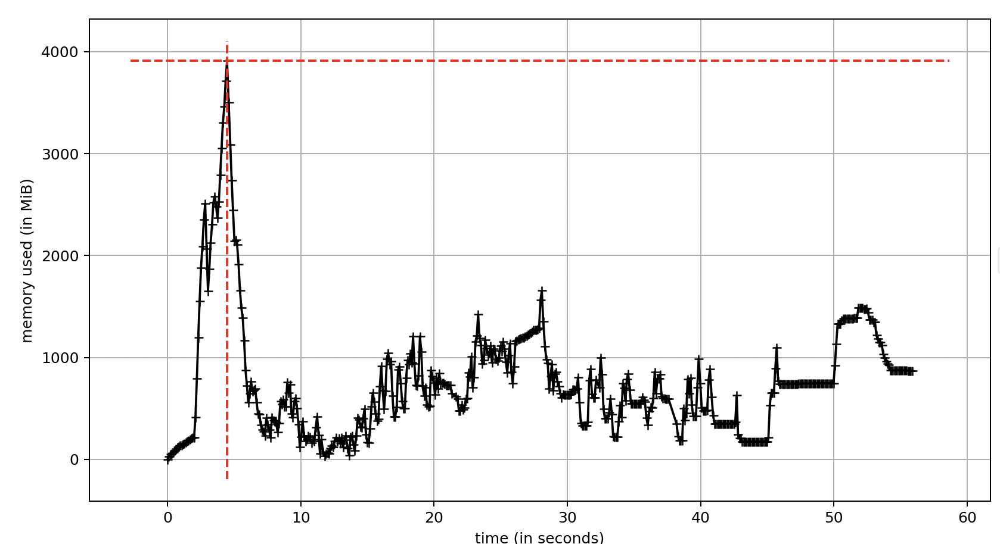
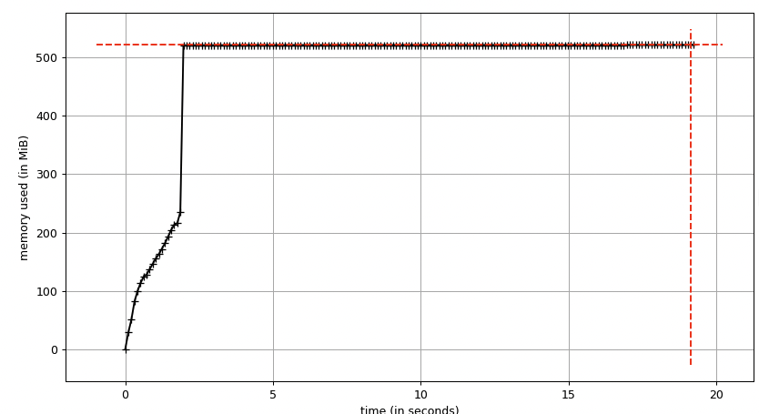
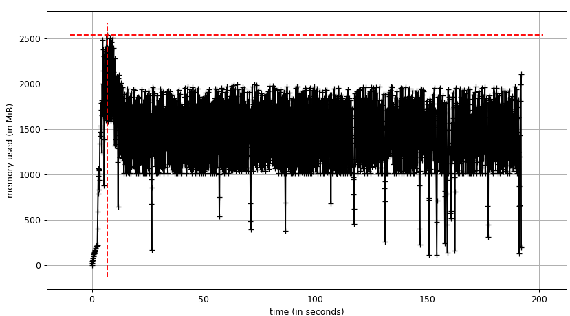

# On Garbage Collection and Memory Optimization in Hamilton

## A chance to nerd out

A few weeks ago, one of our users came to us with an issue. They were processing a rather large set of files,
and noticed that the memory profile would quickly spiral out of control. The memory usage of the program grew until (a) it got prohibitively slow, then died, or (b) it just died due to a memory error.

This was, of course, because we had not optimized the memory at all. If I recall correctly, all we had was a few `TODO -- optimize memory usage` comments scattered throughout.
Now that I had an excuse (a user asking me), I jumped into the rabbit hole of profiling, garbage collection, and optimization, with the goal of reducing Hamilton's memory overhead as much as possible.

In this writeup I will talk a little about python garbage collection, share the change we made to improve Hamilton memory usage, and show its impact through a reproducible example.

If you're not familiar with Hamilton, you can get started at [tryhamilton.dev](www.tryhamilton.dev), or go to the [root](https://www.github.com/dagworks-inc/hamilton) of this repository and read the README.
If you don't want to read it and instead want to jump straight ahead, all you need to know is that Hamilton enables you to define your code as a directed acyclic graph (DAG) of python functions,
and runs them for you. It differs from orchestration frameworks (Airflow, Metaflow, etc...) in that it is a micro orchestrator -- Hamilton does not provision compute or track executions. Rather, it is run as a library
on top of other more infrastructure-focused systems. Its primary aim is to help you organize your code and run on multiple platforms.

## Garbage collection: a primer

Python is a garbage-collected language, meaning that the programmer does not need to worry about allocating or freeing memory. Most popular languages these days are garbage collected,
as modern programmers (such as myself) are too pampered to handle `malloc` and `free` calls. Python uses a reference-counting methodology as its primary tool to free up memory. This means that every object in python
has a reference count associated with it -- when the reference count goes to zero, the system can garbage collect it. You can actually track the references by using `sys.getrefcount`:

```python
>>> import sys
>>> sys.getrefcount(10000)
2
>>> sys.getrefcount(object())
1
>>> sys.getrefcount(1)
97
```

Python utilizes [integer interning](https://towardsdatascience.com/optimization-in-python-interning-805be5e9fd3e) to cache references to common integers, so the numbers above can get quite weird (97 live references to the number 1).

Note that a recursive pointer will never have zero references, even if the object is no longer used, as it always has a reference to itself.  Thus, python uses
a much more nuanced, highly optimized graph traversal to perform the majority of its garbage collection. While we won't go through it here (and it turns out it won't be particularly relevant to this post), I would be remiss not to mention it.
You can (and should!) read about it at [python.org](https://devguide.python.org/internals/garbage-collector/) -- it leverages an interesting optimization around object lifecycle/ object generations to which I will not do justice here.
The algorithm is nuanced but not too hard to grok, and you can learn a lot about the way python works from reading through it.

Before we move back to the original problem, I want to note two things about garbage collection in python:

1. You can force (the more sophisticated version of) garbage collection with `gc.collect()`
2. Garbage collection can be hairy -- python's goal is to ensure enough room is left for objects to be created, and is happy to take up the memory it needs in order to optimize performance

## Minimimum reproducible example

Remember the original problem that spawned this? We're going to write a script that will help us isolate it (always simplify your bugs to a [minimum reproducible example](https://stackoverflow.com/help/minimal-reproducible-example)!).

It will do two things:

1. Create a DAG that comprises a chain of _n_ nodes in a chain
2. Initialize (in the first task) a dataframe of size roughly 100mb (this is parameterized at runtime)
3. Have each subsequent task take the prior result as an input, perform an immutable transformation, and return the result

This is an easy test -- without garbage collection, the memory usage should grow linearly with the number of tasks. With garbage collection, it should stay constant.

Here's the basic pseudocode, you can find the actual script in [memory_test.py](memory_test.py).

```python
def foo_0(memory_size: int = 100_000_000) -> pd.DataFrame:
    # Number of rows in the DataFrame
    dataframe = build_dataframe_with_size(memory_size)
    return df


count = 0

@parameterize(
    **{f"foo_{i}": {"foo_i_minus_one": source(f"foo_{i-1}")} for i in range(1, NUM_ITERS)}
)
def foo_i(foo_i_minus_one: pd.DataFrame) -> pd.DataFrame:
    global count
    count += 1
    print(f"foo_{count}")
    return modify_dataframe(foo_i_minus_one)
```

Note that this makes clever use of the decorator `@parameterize` to form a long chain -- each step is parameterized to take the
output of the previous step as an input.

While memory is now optimized, if you comment out this [one line](https://github.com/DAGWorks-Inc/hamilton/blob/20d7efa83f2d21a7a8b2e377c1e9cc683da4138e/hamilton/execution/graph_functions.py#L170) of code and replace it with `pass`
you can recreate the old behavior (fork + install + do `pip install -e .` to ensure the old version is installed/play around).

When you try to run this on your macbook, it will, in all likelihood, fail (if not, up the `NUM_ITERS` until it does). Not only will it fail,
but it will also do so spectacularly. My music started skipping, the UI became less responsive, and I had to slam ctrl-c to get it to stop.
Eventually it will give up on its own (a dialog will pop up saying that the system is out of memory). This is all to be expected -- your computer
needs memory to function, and the abomination of a python program we've created is draining it all.

Let's figure out exactly what's happening.

## Profiling memory

In order to profile memory, we're going to be using the [memory_profiler](https://pypi.org/project/memory-profiler/) package. Sadly, it is
no longer maintained, but it still works well (if anyone can maintain it, you'll be doing the world a favor).

Let's run the program of death once more, this time with memory profiling enabled:

```bash
pip install memory_profiler
mprof run sequential.py
mprof plot
```

We get the following, demonstrating the first 350 cycles of the application prior to accidental termination.



This may not be what you expected -- I certainly anticipated this to slowly increase until it plateaued, then stop. In fact, it *does* do that for the first few seconds.
I only have 16 gb of memory on my laptop (OK, _only_ isn't fair, we've sent people to the moon with far less...), and about 4 of those are free for python to use (jetbrains/pycharm hogs the rest, it would seem).
You can see it first move up slowly (it's setting things up), then rapidly increase for the first 30-40 iterations as it allocated the 100mb dataframes. It then hits a maximum, and starts making use
of swap space. You can actually see it bouncing around, juggling between swap and physical memory. Note that the peaks get further and further away as it runs out of
swap space, takes longer to handle memory retrieval/commitment, and eventually just dies.

## Pruning Memory

Now that we have a grasp on the problem and a profiling methodology, let's dig in to see what we can fix. Luckily, the root of the issue was fairly clear.

To execute a Hamilton node and just its required upstream dependencies, we conduct a depth-first-traversal of the graph, storing results
we've realized in a `computed` dictionary. We use this for multiple purposes -- it can help us (a) avoid recomputing nodes and instead store
the results, and (b) return the final results at the end that we need. The problem is that we held onto all results, regardless of whether we would need them later.
In the (albeit contrived) script above, we only need the prior node in the chain to compute the current one.

How do we fix? Well, we need to do a little garbage collection of our own. Specifically, after we've computed a node, we no longer need to store its result
if both of the following criteria are met:
- Any subsequent node that depends on the node we are considering has already been computed
- The node we are considering is not a required output (specified by the user in `final_vars`)

As we store bidirectional edge pointers, we can easily check (1), and (2) is a parameter to the execution function.
The last thing we need to know is *when* to check a result for garbage collection.

The easy answer is that we can always check all upstream nodes after we have computed a node. Here's the addition we made.
It makes use of the `for/break/else` [pattern](https://stackoverflow.com/questions/9979970/why-does-python-use-else-after-for-and-while-loops) in python
(it's a strange one), but should otherwise be simple to read. The code below is a copy of the code in [graph_functions.py](https://github.com/DAGWorks-Inc/hamilton/blob/2c81bc48169b0a4fbaacfcb694879856e49021ab/hamilton/execution/graph_functions.py#L159-L170).

```python
for dep in node_.dependencies:
    if dep.name in computed and dep.name not in nodes_to_compute:
        for downstream_node in dep.depended_on_by:
            if (
                downstream_node.name not in computed
                or downstream_node.name in nodes_to_compute
            ):
                break
        else:
            del computed[dep.name]
```

Note that this solution leaves a few things to be desired (I conveniently left out the comments above...). In particular, it has two shortcomings:
1. It is not efficient -- a true reference count (much like python does) would allow us to bypass the inner for-loop
2. It is not aggressive enough -- there is an edge-case where we could elect *not* to prune a node as it is required by a node that is not in the execution path

That said, it is a dramatic improvement, and in all but the most diabolical set of cases will be functionally optimally with no performance hit.

Let's see how it works:

.

A few things jump out:
1. The whole application is close to an order of magnitude faster (70s for 350 versus 20s for 1000 iterations)
2. The memory usage plateaus quickly, and regularly garbage collects

Furthermore, it is not doing any of the sophisticated garbage collection we discussed before -- it appears to just be decrementing the reference count after
hamilton and the function no longer need it, only storing pointers to the current and previous results. In fact, by leveraging [gc.set_debug](https://docs.python.org/3/library/gc.html#gc.get_debug),
you can verify that the garbage collector is largely unused, and python instead relies on reference counting.

You can see a similar pattern if you up the allocation size to 1gb. It occasionally dips below 1gb of used memory, although that is likely due to sampling oddities. It may even *still* be using swap space.


## Wrapping it up

After solving this memory leak, we also fixed one more -- in Hamilton's [dynamic execution capabilities](https://blog.dagworks.io/p/counting-stars-with-hamilton),
it was doing something similar for parallel execution -- storing all the results and not letting go of them.

You can find the original fix + some initial thoughts on the script/evidence as we learned this in the [PR](https://github.com/DAGWorks-Inc/hamilton/pull/374).

Now that we've come out of the rabbit hole, we'll leave you with a few parting thoughts:

1. If you ever find yourself really digging into garbage collection in python for data analysis, the odds are that you should probably just be using a bigger machine.
2. If you're using Hamilton, you should upgrade to the latest version -- it has a lot of improvements and new capabilities, and is optimized to consume less memory.
3. Garbage collection is *really* interesting, and I just scratched the surface. One of my first mentors in software engineering was a pioneer in the discipline of real-time garbage collection, and I've been trying to soak up as much as I could ever since I first heard about the algorithmic challenges involved.
